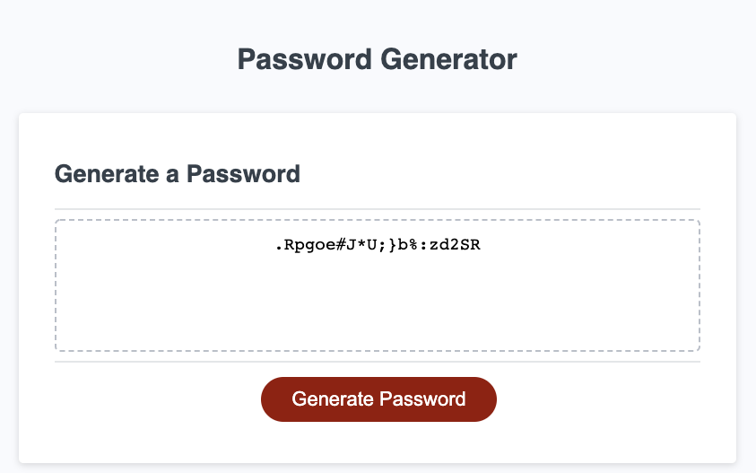

# Password Generator

This is a simple password generator that generates passwords that match a user's specifications.
The user can specify character sets to use (uppercase letters, lowercase letters, numbers, and special characters) as well as the password length (8-128 characters).

Link to deployed page: https://gordon-magill.github.io/password_generator/

## Authors

- [@GordonMagill](https://github.com/Gordon-Magill)

